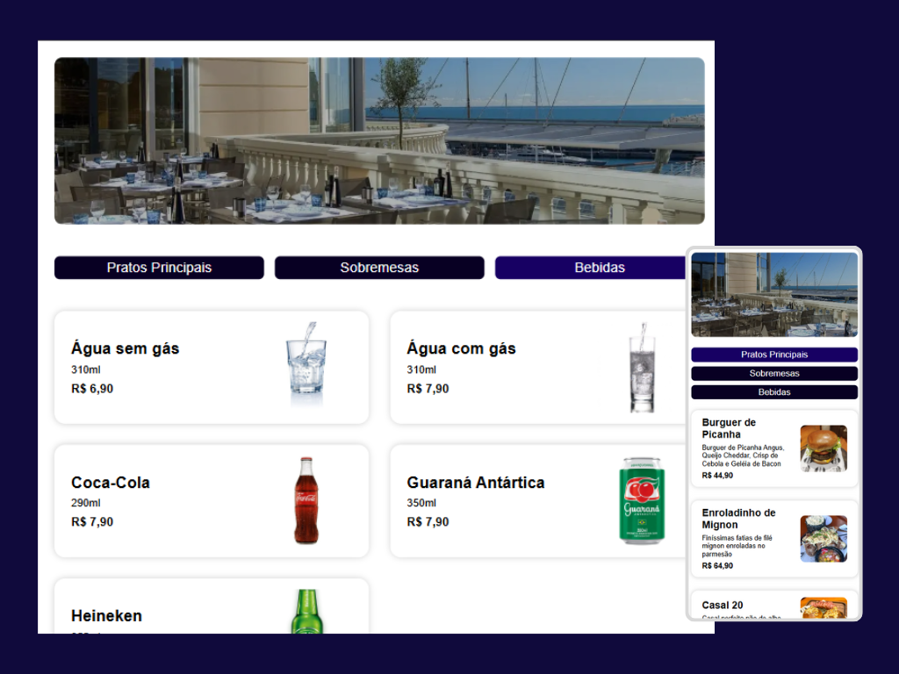

# 🍽️ Cardápio Digital

## 📌 Descrição
Projeto de estudo desenvolvido durante o intensivão de JavaScript da Hashtag Programação. A aplicação permite que o cliente visualize as opções de pratos, bebidas e sobremesas disponíveis no cardápio por meio de eventos de clique.
O layout é totalmente responsivo, garantindo uma boa experiência em dispositivos pequenos, médios e grandes. Este projeto foi uma excelente oportunidade para praticar conceitos básicos do React.
## 🚀 Funcionalidades e Práticas
- Criação de projeto com Vite
- Componentes funcionais
- Uso de props
- Controle de estado com useState
## 🛠️ Tecnologias Utilizadas
  
<!-- CSS Badge -->

<!-- JavaScript Badge -->

<!-- React Badge -->

## 🔗 Demonstração

